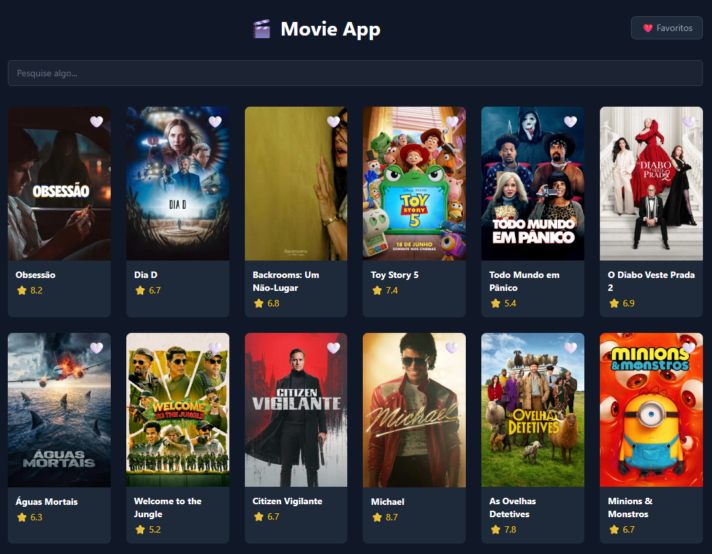

# 🎬 Movie App

Aplicação de filmes desenvolvida com React, consumindo a API do TMDB (The Movie Database).

## Índice

- [Visão geral](#visão-geral)
  - [Screenshot](#screenshot)
  - [Links](#links)
- [Meu processo](#meu-processo)
  - [Tecnologias utilizadas](#tecnologias-utilizadas)
  - [Funcionalidades](#funcionalidades)
  - [O que aprendi](#o-que-aprendi)
  - [Próximos passos](#próximos-passos)
- [Autor](#autor)

## Visão geral

### Screenshot

### Links

- Repositório: [github.com/marcusvthome/movie-app](https://github.com/marcusvthome/movie-app)
- Live Site: [movie-app-nine-lilac.vercel.app](https://movie-app-nine-lilac.vercel.app)

## Meu processo

### Tecnologias utilizadas

- React
- React Router DOM
- Tailwind CSS
- API do TMDB
- LocalStorage
- Vite

### Funcionalidades

- Listagem de filmes populares
- Busca de filmes em tempo real
- Página de detalhes com gêneros, nota e sinopse
- Sistema de favoritos com persistência no localStorage
- Loading skeleton durante o carregamento
- Deploy na Vercel

### O que aprendi

Este foi meu primeiro projeto em React e já me sinto empolgado para continuar trabalhando em novas features e criar novos projetos. Aprendi conceitos fundamentais como useState, useEffect, React Router e consumo de APIs reais. Alguns conceitos como o useState me deixaram confuso no início, mas pesquisei mais a respeito e aprimorei o conhecimento.

### Próximos passos

Quero continuar aprendendo mais conceitos do React, criar projetos visualmente bonitos, funcionais e com relevância, e evoluir cada vez mais como desenvolvedor frontend.

## Autor

- Frontend Mentor - [@marcusvthome](https://www.frontendmentor.io/profile/marcusvthome)
- GitHub - [@marcusvthome](https://github.com/marcusvthome)